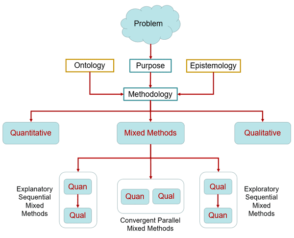

# Research Methodology and Design

## Research Problems

Academic research involves describing and explaining a phenomenon of importance and value to humanity. In research, this is expressed in terms of a problem statement where the investigator describes the situation that needs addressing to improve the lives of individuals. This could be in the form of clear-cut issues like preventing terrorist threats or dealing with social, racial, and gender inequalities (to name but a few), or it could involve an opportunity to gain something of value, like increasing the entrepreneurial potential of individuals or strengthening their leadership skills. Value becomes of essence either by preventing its loss or increasing its gain.

Articulating a research-worthy problem is much easier after conducting a thorough review of existing literature. Hence, researchers may have difficulty expressing an appropriate topic and area of inquiry before they have a solid understanding of what has already been written about a given topic. Such understanding comes from reading many articles and identifying patterns, issues, and gaps in the body of knowledge. Keep in mind here that a gap in the literature is not a research problem. For example, the fact that there are no peer-reviewed academic research publications on aliens living among us does not suggest that this “problem” would generally be considered suitable for research (unless maybe if believing in such a thing adversely affects society).

## Research Methods

When a research problem is identified, a research methodology, or a scientific way to research a problem, should be selected. The method in which research is conducted is an important part of the research process. Common research methods in information sciences and technology include qualitative, quantitative, mixed methods and constructive research. Regardless of the chosen method, most research projects follow a standard sequence of activities, sometimes referred to as the research lifecycle, or research process.

Figure 1 depicts the core methodologies to use in information and social sciences research. In addition to the quantitative, qualitative, and mixed methods, we will see in this course the constructive artifact approach. This is a popular alternative in information technology and computer as it is based on the development of some software (typically) and/or hardware to measure a specific aspect of observation.

