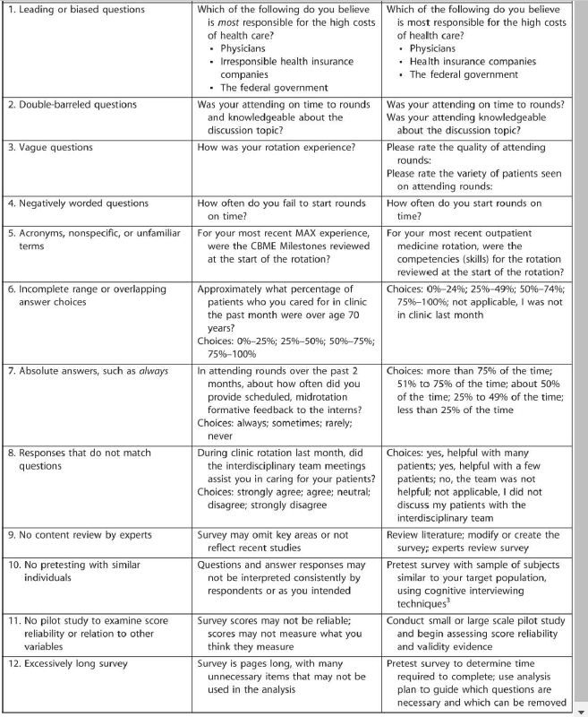

# Readings for the week

## Assignment Specific Materials

This week's [assignment](../Assignment.md) requires writing a bibliogrpahy and describing data collection methods.

Initial plans started with [Technology](technology) as the primary topic, but transitioned toward [COVID-19](covid-19), due to the ease of connecting a running theme between the topics.

## How to Create a Bad Survey Instrument (2017)

Sullivan, G. M., & Artino, A. R. (2017). How to Create a Bad Survey Instrument. Journal of Graduate Medical Education, 9(4), 411–415. [DOI](https://dx-doi-org.proxy1.ncu.edu/10.4300%2FJGME-D-17-00375.1).  [BadSurvey.pdf](BadSurvey.pdf).

## Development and validation of the educational technologist multimedia competency survey (2014)

Ritzhaupt, A. D., & Martin, F. (2014). Development and validation of the educational technologist multimedia competency survey. Educational Technology Research Development, 62, 13-33. [DOI](https://doi-org.proxy1.ncu.edu/10.1007/s11423-013-9325-2). [develop_survey.pdf](develop_survey.pdf).

## Preparing and Conducting Interviews to Collect Data (2013)

Doody, O., & Noonan, M. (2013). Preparing and conducting interviews to collect data. Nurse Researcher, 20(5), 28-32. [DOI](https://doi-org.proxy1.ncu.edu/10.7748/nr2013.05.20.5.28.e327). [ConductingInterviews.pdf](ConductingInterviews.pdf).
