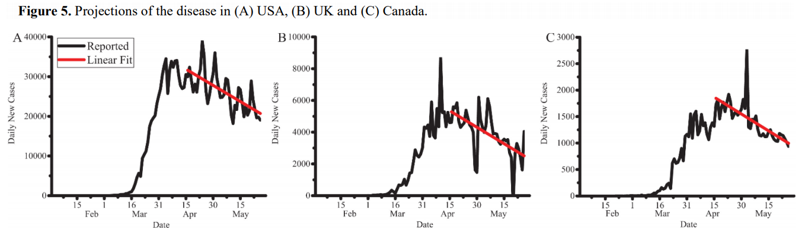

# Covid-19 Articles

## Preparedness of Our Emergency Department (2020)

Hou, Y., Zhou, Q., Li, D., Guo, Y., Fan, J., & Wang, J. (2020). Preparedness of Our Emergency Department During the Coronavirus Disease Outbreak from the Nurses’ Perspectives: A Qualitative Research Study. Journal of Emergency Nursing, 46(6), 848–861. [DOI](https://doi-org.proxy1.ncu.edu/10.1016/j.jen.2020.07.008). [EmergedDeptPreparedness.pdf](EmergedDeptPreparedness.pdf).

> [Introduction]: This study explores the preparedness of our emergency department during the COVID-19 outbreak from the nurses’ perspectives, providing a reference and basis for our emergency department's response to public health emergencies. [Methods]: Using qualitative research methods, semistructured interviews were conducted with 12 emergency nurses who met the inclusion criteria, and Colaizzi analysis was used for data analysis, summary, and induction.

### How was the data collected

### What do the results show

There are four clusters of themes, specifically:

- Organizational Preparedness
  - Timely adjustments of department functions
  - Strengthening of Multidisciplinary Cooperation
  - Timely updating workflows
  - Timely provision of adequate protective medical supplies
  - Trust in the organization
- Personal Preparedness
  - Self-adjusting pyschology
  - Experiencing Mortal distress and Making choices
  - Professional Nusing Values
  - Knwoledge Seeking
  - Actively communicating
- Patient and Family Prepardness
- Limitations and challenges
  - Cross department multidisciplinary collaboration
  - Deficiency in rapid diagnosis and Treatment of Patients

## Quantitative analysis and mathematic modeling of the global outbreak of COVID-19 (2020)

Yanyan Jiang, Xuefeng Jiang, Wenjun Tong, & Jingming Zhou. (2020). Quantitative analysis and mathematic modeling of the global outbreak of COVID-19. Journal of Infection in Developing Countries, 14(10), 1106–1110. [DOI](https://doi-org.proxy1.ncu.edu/10.3855/jidc.13150). [ModelGlobalOutbreak.pdf](ModelGlobalOutbreak.pdf).

> To better understand the epidemics in different areas, `the progress percentage was generated in this study by dividing everyday total confirmed case number by the up-to-date total case number`, so data obtained from different countries and territories can be put together and compared directly regardless of the large difference in the magnitude of numbers. The global outbreak data were `analyzed and categorized into 4 groups based on different epidemic curve stages`. The grouping pattern suggests that the geographical position may not play a critical role in the progress of COVID-19 epidemic. In this report, we also `used a mathematic model to predict the progress of COVID-19 outbreak` in UK, USA and Canada in Group 3, providing valuable information for assessing the risk in these countries and the timing of reopening business.

### What are the four groups

If we look at an epidemic curve, an epidemic in an area can be divided into 4 stages based on the increase of total confirmed cases:

1. _Stage 1_, sporadic cases or limited local transmission, creating undulating curve;
2. _Stage 2_, substantial local transmission, featuring a takeoff of the curve;
3. _Stage 3_, emerging of large number of new cases, causing an exponential increase;
4. _Stage 4_,fewer new cases reported than peak, leading to flattening of the curve till the end of the epidemic

### What did they conclude

This study is the first to use progress percentage to plot epidemic curve and enables direct comparison of data regardless of the large difference in the magnitude of numbers.

## Forecasting the timeframe of 2019-nCoV and human cells interaction with reverse engineering (2020)

Sohail, A., & Nutini, A. (2020). Forecasting the timeframe of 2019-nCoV and human cells interaction with reverse engineering. Progress in Biophysics and Molecular Biology, 155, 29–35. [DOI](https://doi-org.proxy1.ncu.edu/10.1016/j.pbiomolbio.2020.04.002). [ForecastingCovid.pdf](ForecastingCovid.pdf)

## Recent progress and challenges in drug development against COVID-19 (2020)

Abd El-Aziz, T. M., & Stockand, J. D. (2020). Recent progress and challenges in drug development against COVID-19 coronavirus (SARS-CoV-2) - an update on the status. Infection, Genetics and Evolution, 83. [DOI](https://doi-org.proxy1.ncu.edu/10.1016/j.meegid.2020.104327). [DrugDevCovid.pdf](DrugDevCovid.pdf)

## The COVID-19 pandemic effects on the hospitality industry (2021)

Shapoval, V., Hägglund, P., Pizam, A., Abraham, V., Carlbäck, M., Nygren, T., & Smith, R. M. (2021). The COVID-19 pandemic effects on the hospitality industry using social systems theory: A multi-country comparison. International Journal of Hospitality Management, 94. [DOI](https://doi-org.proxy1.ncu.edu/10.1016/j.ijhm.2020.102813). [HospitalityImpact.pdf](HospitalityImpact.pdf)

## Emotions and Reactions to the Confinement by COVID-19 (2020)

María de los Dolores Valadez, Gabriela López-Aymes, Norma Alicia Ruvalcaba, Francisco Flores, Grecia Ortíz, Celia Rodríguez, & África Borges. (2020). Emotions and Reactions to the Confinement by COVID-19 of Children and Adolescents With High Abilities and Community Samples: A Mixed Methods Research Study. Frontiers in Psychology, 11. [DOI](https://doi-org.proxy1.ncu.edu/10.3389/fpsyg.2020.585587). [fpsyg-11-585587](fpsyg-11-585587.pdf).
