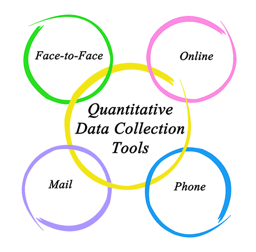

# Quantitative Research

The quantitative methodology is based on meaning derived from data in numerical form like scale scores, ratings, durations, counts, etc. This is in contrast to qualitative methods where meaning is derived from narratives. The numbers of quantitative research can come directly from measurements during observation or indirectly by converting collected information into a numerical form (i.e., a Likert scale, which you will see later).

Quantitative research methods reflect a deductive approach to research, in which the main focus is to test a particular theory of observable phenomena and relationships between those phenomena and to make predictions about those phenomena. Quantitative research approaches reflect the assumption that reality is objective, measurable, and fact-based. Quantitative studies are conducted under controlled conditions to isolate possible causal effects and correlations. Results from quantitative research include comparisons of means, correlations, statistical inferences, and statistical significance of findings. Results are generalizable to the population under study.

In order to produce reliable evaluations, quantitative research requires large numbers of participants, and the analysis is done through statistical tools. Large samples ensure better representativeness and generalizability of findings as well as the proper application of the statistical tests. The investigator and the investigated are independent entities and, therefore, the investigator can study a phenomenon without influencing it or being influenced by it. This ensures an objective treatment of the collected data, increasing in this way the reliability of the study. Facts are separated from values and in this way, the “truth” of what is observed is the external reality of the observation. This is also supported by the rigid procedures that need to be followed during data collection that in addition to ensuring reliable measurement eliminates potential biases and personal values of the researcher.