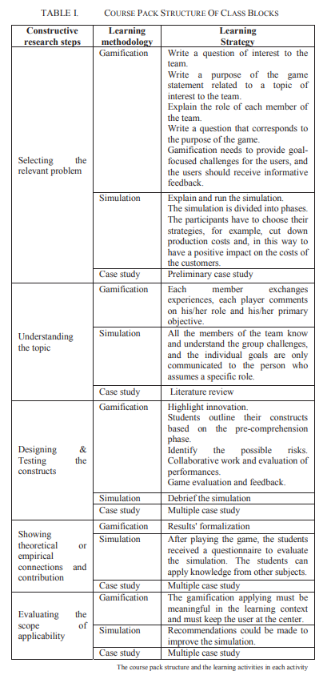
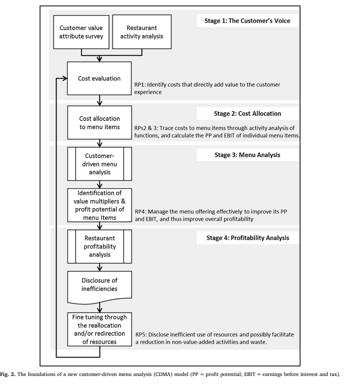
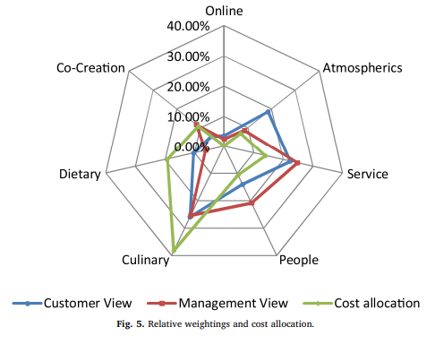

# Constructive Research Articles

## New model of emergency communication for disaster relief in remote areas (2016)

A. E. Aburawi, S. Salic and M. Krampell, "New model of emergency communication for disaster relief in remote areas," 2016 12th International Conference on Innovations in Information Technology (IIT), Al-Ain, 2016, pp. 1-5, doi: 10.1109/INNOVATIONS.2016.7880019. [EmergencyCommunication.pdf](EmergencyCommunication.pdf).

*What is their objective*?

Recently multiple political and natural events have disrupted communication.  These distruptions occur during periods where the reliability of these systems is most critical.  The authors seek a solution that is:

- Easy to use - no advanced administration
- Easy to install - if not already in place
- Cheap to operate
- Long range communication - at least 1000km
- Available for many simulateous users

*What artifacts did they produce?*

- The researchers build a proof-of-concept that relies on one-way short wave radio
- This capability needs to eventually function with existing smartphones or integrate into these products.
- The POC uses an Arduino board with various components to simulate a real smartphone

## Measuring Cybersecurity Wellness Index of Critical Organisations (2018)

H. Jazri, O. Zakaria and E. Chikohora, "Measuring Cybersecurity Wellness Index of Critical Organisations," 2018 IST-Africa Week Conference (IST-Africa), Gaborone, 2018, pp. Page 1 of 8-Page 8 of 8. [MeasuringCybersecurity.pdf](MeasuringCybersecurity.pdf).

The authors introduce a concept of _cybersecurity wellness for Critical Organizations_ and provide a measurement index.  This artifact allows organizations to compare and evaluate against one another more easily.  They can also follow a bottom-up approach to identify map problems and potential solutions.

*What artifacts did they produce?*

The researchers purposefully selected twenty critical organizations that fall within a well-defined criteria.  Next, the group collected data on vital signs and verifiable feature selection.  They coalesce these results into `Ten Trusted Facilitators` that describe the security posture and maturity of an organziation.

*What makes their solution unique?*

Similar studies focus on a top-down analysis of organizations, across 114 vital signs.  They are unique in their bottom-up perspective and focusing on only a subset of the most highest risk areas.  From this subset they can map _security functions_ into a maturity level -- simplifying prioritzation of future efforts.

Those functions are: Identify, Protect, Detect, Response, Recover.  Each is graded from Not Implemented (0) to Very Effective (3).

## Learning Strategies to Optimize the Assimilation of ITC2 Competencies for Business Engineering Programs (2018)

A. Luna, M. Chong and D. Jurburg, "Learning Strategies to Optimize the Assimilation of ITC2 Competencies for Business Engineering Programs," 2018 IEEE International Conference on Teaching, Assessment, and Learning for Engineering (TALE), Wollongong, NSW, 2018, pp. 616-623, doi: 10.1109/TALE.2018.8615444. [LearningStrategies.pdf](LearningStrategies.pdf).

Modern instructional training needs to incorporate `Revolution 4.0`, which is a fancy term for IoT systems.  These technologies can promote more engagement by `gamification` of learning.

*What artifacts did they produce?*

The researchers modified an undergraduate course of Business Engineering at a private university.  They examined the scores of students that took the course from 2013-6 and 2016-7 semesters.  Each iteration is roughly 15-weeks in length and encompasses roughly 300 total students.

*What did those results show?*

The students spent more time playing the games, which caused more engagement.  This additional study time translates into higher scores and lower standard deviation.  Teacher reviews also increased as the students had "more fun learning."

## Customer-driven menu analysis (2020)

Nemeschansky, B., von der Heidt, T., & Kim, P. B. (2020). Customer-driven menu analysis (CDMA): Capturing customer voice in menu management. International Journal of Hospitality Management, 91. doi:10.1016/j.ijhm.2019.102417.  [CustomerDrivenMenu.pdf](CustomerDrivenMenu.pdf).

Resturants owners use `Menu Analysis` to determine which products and most effective and how to engage their customers.  MA typically focuses on _internal costs and ignores externally defined value_.  This makes it challenging to consider the customer's persception and drive higher sale-volumes.

*What artifacts did they build?*

The researchers define a `Customer-Driven Menu Analysis Model`, where _the customer defines preferences linking the internal cost structure of the resturant to externally defined (customer) values.  They provide a coherent and comprehensive understanding of current MA methods._

Their approach is also unique because other solutions focus on individual product profitability.  Instead, they focus on customer profitability (e.g., repeat visits and cross-selling).

These distinctions are reflected through a value creation model, that spans five cost types:

1. customer value-added (CVA);
2. business valueadded current (BVA-C);
3. business value-added future (BVA-F);
4. business value-added administrative (BVA-A);
5. and non-value-added (NVA)

*How did they measure the results?*

The authors had access to a 90-seat bistro in downtown Auckland, New Zealand.  The resturant averaged $75,000 weekly revenue and then measured the influence of changes to the menu.

Customers (~400) would also complete surveys in Likert scale to assess what is important to them.  These recommendations drove changes in menu designs to change the emphasis on different aspects (e.g., online ordering versus in-person service).

## Implementing self-service business analytics supporting lean manufacturing (2018)

Lizotte-Latendresse, S., & Beauregard, Y. (2018). Implementing self-service business analytics supporting lean manufacturing: A state-of-the-art review. IFAC PapersOnLine, 51(11), 1143–1148. doi:10.1016/j.ifacol.2018.08.436.  [BusinessAnalytics.pdf](BusinessAnalytics.pdf).
