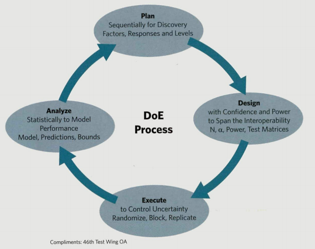

# Readings

## Design science in information systems research (2004)

Hevner, A. R., March, S. T., Park, J., & Ram, S. (2004). Design science in information systems research. MIS Quarterly, 28(1), 75-105.

The paper describes the design-science paradigm through the use of new and innovative artifacts that extend the boundaries of human and organizational capabilities. doi:10.2307/25148625.  [DesignScience.pdf](DesignScience.pdf).

> That is, design-science research requires the creation of an innovative `purposeful artifact` (Guideline 1) for a `specified problem domain` (Guideline 2). Because the artifact is purposeful, it must `yield utility` for the specified problem. Hence, thorough evaluation of the artifact is crucial (Guideline 3). Novelty is similarly crucial since the artifact `must be innovative`, solving a heretofore unsolved problem or solving a known problem in a more effective or efficient manner (Guideline 4). In this way, design-science research is differentiated from the practice of design. The artifact itself must be `rigorously defined, formally represented, coherent, and internally consistent` (Guideline 5). The process by which it is created, and often the artifact itself, `incorporates or enables a search process` whereby a problem space is constructed and a mechanism posed or enacted to find an effective solution (Guideline 6). Finally, the results of the design-science research `must be communicated effectively` (Guideline 7) both to a technical audience (researchers who will extend them and practitioners who will implement them) and to a managerial audience (researchers who will study them in context and practitioners who will decide if they should be implemented within their organizations).

|Design-Science Research Guidelines| Guideline Description|
|---------------------------------|----------------------------|
|Guideline 1: Design as an Artifact |Design-science research must produce a viable artifact in the form of a construct, a model, a method, or an instantiation.|
|Guideline 2: Problem Relevance| The objective of design-science research is to develop technology-based solutions to important and relevant business problems.|
|Guideline 3: Design Evaluation| The utility, quality, and efficacy of a design artifact must be rigorously demonstrated via well-executed evaluation methods.|
|Guideline 4: Research Contributions| Effective design-science research must provide clear and verifiable contributions in the areas of the design artifact, design foundations, and/or esign methodologies.
Guideline 5: Research Rigor| Design-science research relies upon the application of rigorous methods in both the construction and evaluation of the design artifact.
Guideline 6: Design as a Search Process| The search for an effective artifact requires tilizing available means to reach desired ends while satisfying laws in the problem environment.|
|Guideline 7: Communication of Research| Design-science research must be presented effectively both to technology-oriented as well as management-oriented audiences.|

## Design of Experiments for Information Technology Systems (2012)

Silvestrini, R. T., Parker III, W. J., & Sammito, G. (2012). Design of Experiments for Information Technology Systems. Defense AT&L, 41(5), 30–35. [EBSCO](https://search-ebscohost-com.proxy1.ncu.edu/login.aspx?direct=true&db=bth&AN=80409129&site=eds-live). [Experiments.pdf](Experiments.pdf).

